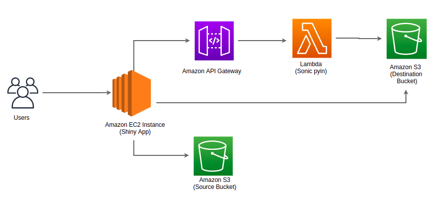

# Overview 

This Terraform project creates almost all required AWS resources as well as building and packaging the required Lambda dependencies and dockerizing the Shiny app.

# Architecture Overview
Deploying this solution wirh Terraform builds the following environment in the AWS Cloud:



## Prerequisites
1. Terraform 0.15.x or later =>[Installation Guide](https://www.terraform.io/downloads.html)
2. AWS CLI => [Installation Guide](https://aws.amazon.com/cli/)
3. Docker


# Components

## Base 
Creates the foundational infrastructure for the application's infrastructure (boilerplate). These Terraform files will create:

- Two S3 Buckets (source and destination)
- A Lambda Function (Sonic pYIN), including its deployment process (building and pushing the container image)
- The Amazon API Gateway used to invoke Lambda function
- A Cognito identity pool (used to grant webserver permissions to read and upload to the newly created S3 buckets)

Typically, these Terraform files will only need to be run once, and then should only
need changes very infrequently. This will output :

| Name | Description |
|------|-------------|
| api_base_url | The AWS API Gateway endpoint URL  |
| s3_source_bucket  | The S3 source bucket name  |
| s3_destination_bucket | The S3 destination  bucket name  |
| aws_cognito_identity_pool  | The ID of the Identity Pool |

## Deploying the Shiny app

Packages and deploys the Shiny App.

- Create VPC 
- Create Security Groups
- Launch an EC2 instance from a custom Amazon Machine Image (AMI)


This will output "Shiny App URL" in the terminal, which can be used to access Shiny app webserver.

# Usage

```

# Configure environment variables:
$ export AWS_ACCESS_KEY_ID=put_your_access_key_id_here
$ export AWS_SECRET_ACCESS_KEY=put_your_secret_access_key_here

# Move into the boilerplate directory
$ cd boilerplate

$ make plan

$ make apply

# Go back to the parent directory
$ cd ..

$ make plan

$ make apply

```

If you want to delete all these resources, run the following command:

```
$ make destroy
$ cd boilerplate
$ make destroy
```
# Deploying Shiny apps to the EC2

```
# upload your shiny app files to EC2
$ scp -i shiny-ec2-key.pem  -r <local-shiny-app-folder-path>  ubuntu@<ip>:/home/ubuntu
# connect to your instance using SSH
$ ssh -i shiny-ec2-key.pem ubuntu@<ip>
# move your files from /home/ubuntu/ to /srv/shiny-server/ (this is where the Shiny Server is located)
$ mv /home/ubuntu/<shiny-app-folder> /srv/shiny-server
# install all the packages for your application
$ sudo su - \
-c "R -e \"install.packages('package', repos='https://cran.rstudio.com/')\""
$ sudo chown -R shiny /srv/shiny-server/<shiny-app-folder>
$ sudo  systemctl restart shiny-server.service
```
# Setting up SSL 
[Installation Guide](https://github.com/mcetn/shiny-app-aws/blob/main/ssl.md)

